# Python データビジュアライゼーション入門

## Ch.01 データビジュアライゼーションとは

### Sec.01 ビジュアライゼーションの定義

- Visualization
  - 可視化
  - 視覚化

### Sec.02 ビジュアライゼーションの歴史

### Sec.03 身近なビジュアライゼーション

### Sec.04 データビジュアライゼーションの機能と目的

データビジュアラゼーションの機能

1. 概要を把握する
   - 概観
   - データの全体像を把握する
2. 発見を手助けする
   - 発見
   - データの特徴や新しい事象を見つける
3. 伝達する
   - 伝達
   - コミュニケーションの促進
   - データの読み手に「1.」と「2.」を伝える

データビジュアラゼーションの目的

- データ分析者にとって
  - データへの理解を深めることができる
- 情報の読み手にとって
  - わかりやすく知見を得ることができる

## Sec.05 意思決定におけるデータビジュアライゼーション

## Sec.06 データビジュアライゼーションの意義

- データの情報処理プロセス（DIKWピラミッド）
  - Data
    - 観測された事実の集まり
  - Information
    - データを構造化する
  - Knowledge
    - データの背景を知り、文脈をもって事実を伝える
    - データに関する背景知識や経験を組み合わせる
  - Wisdom
    - 判断やより深い解釈を加えて、「何を行うべきか」というデータには含まれなかった「新たな価値」を生み出す

- 探索的データ分析におけるビジュアライゼーション
  - データのばらつき、基本統計量などを可視化
  - 散布図
  - ヒストグラム
  - 箱ひげ図
- データ分析結果の伝達のためのビジュアライゼーション
  - データを通じたコミュニケーションを行う役割
  - 棒グラフ
  - 折れ線グラフ
  - 円グラフ
  - インフォグラフィック

## Sec.07 データビジュアライゼーションのステップ

- 1 データの着眼点を考える
  - 概要: どのようなデータか基礎的な情報を把握する
  - 変化: 時間の経過による変化や条件の変更による違いに着目する
  - 比較: データの属性ごとの違いに着目する
  - 構成: 全体や特定の区分の中の割合に着目する
  - 関係: 変数間における関係の有無や傾向に着目する
- 2 データの収集・処理を行う
  - 着眼点に適したデータを収集し、データの前処理を行う
- 3 着眼点に応じて適切なビジュアライゼーションを行う
  - 着眼点に応じてメッセージが伝わるようなビジュアライゼーションを行う
  - Story telling
    - 読み手の共感を得たり、意外性を与えたりするように読み手を引きつけるような要点をまとめることが必要

## Sec.08｜静的なビジュアライゼーションと動的なビジュアライゼーション

- 静的なビジュアライゼーション
  - 紙媒体
  - pandas, matplotlib, seabornの利用
- 動的なビジュアライゼーション
  - デバイス
  - plotlyの利用

## Sec.09 Pythonでのデータ分析とビジュアライゼーション
